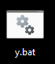

## Let's start with plain html and see how we can enhance it with dagger.js.

---

We can make the element more fun by inserting interactive data into it. To insert data we should add the +loading directive to the element by typing `+loading="{year: 2024}"` like an attribute on the div element. Next we want to show the data in the div content by replacing 2024 with `${year}`.

---

To make the data interactive 

## Todos

- [ ] create a button inside big-daddy with text "click me!"
- [ ] include a `+click=""` attribute on the button element
- [ ] inside the +click attribute type number++

<button>do</button>

## Test for image

